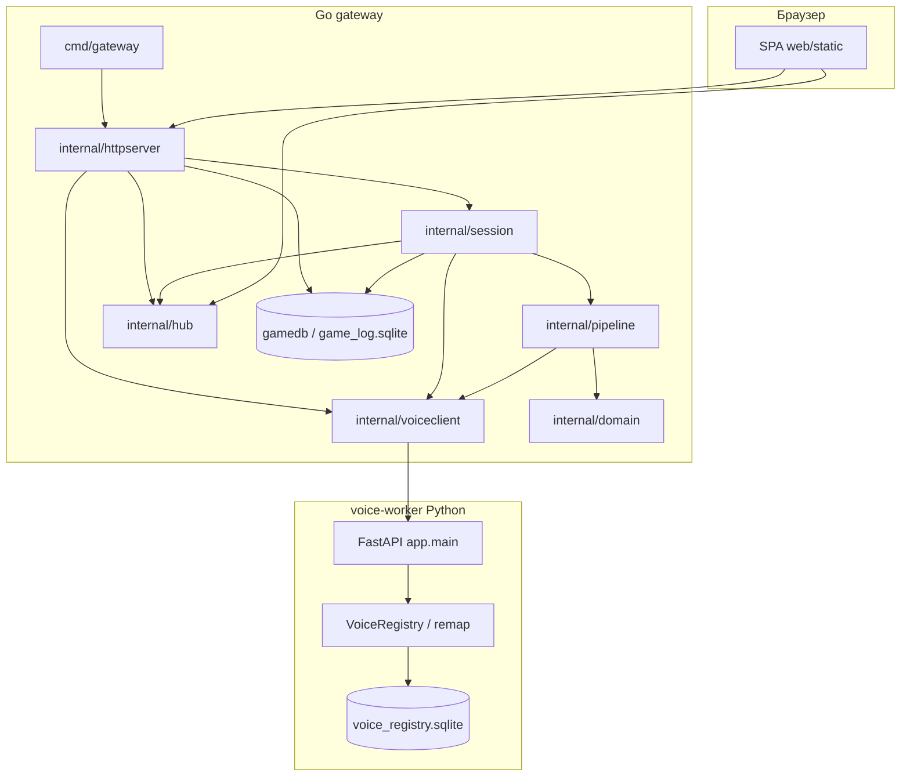

# Архитектура voice-server

Каталог `services/voice-server` — **отдельный Go-модуль** (`module voice-server`), не импортирует код родительского `mafia-analyzer`. Решение состоит из **двух процессов** и **двух независимых SQLite-баз**: gateway (Go) и voice-worker (Python), связанных только по HTTP.

## Обзор

| Компонент | Роль | Персистентность |
|-----------|------|-----------------|
| **Gateway** (`cmd/gateway`) | HTTP + WebSocket, сценарии ingest/file/record, ffmpeg, прокси к Python | **`data/game_log.sqlite`** — партии, реплики, ручные переопределения спикеров |
| **Voice-worker** (`voice-worker/`) | WhisperX, Pyannote, WavLM, реестр голосов (эмбеддинги) | **`voice-worker/data/voice_registry.sqlite`** (или `VOICE_SERVER_DB`; в Colab — на Google Drive при `VOICE_SERVER_USE_GOOGLE_DRIVE`) |

Принципы: зависимости направлены **внутрь** (от delivery к domain); инфраструктура (HTTP-клиент к Python, ffmpeg) изолирована. Gateway **не встраивает** Python — только запросы на `-voice-url` (например ngrok с Colab).

## Диаграмма компонентов

## Слои gateway (упрощённо)

| Слой | Пакет | Роль |
|------|-------|------|
| **Сущности** | `internal/domain` | `Segment` — структуры из JSON voice-worker (`speaker`, `text`, тайминги, `voice_id`, `match_score`) |
| **Персистентность партий** | `internal/gamedb` | SQLite: `game_sessions` (режим, `source_filename`, `capture_source`), `game_segments` (в т.ч. `match_score`), `game_segment_overrides` (ручное переназначение спикера по `seq`) |
| **Сценарии** | `internal/session` | Один глобальный сеанс: ingest / file / record; отмена контекста; нумерация `seq` сегментов; запись в `gamedb`; broadcast в WS |
| **Инфраструктура** | `internal/pipeline` | ffmpeg, нарезка чанков, multipart на `POST /process_chunk` |
| **Клиент worker** | `internal/voiceclient` | HTTP: `process_chunk`, `reset`, `voices`, `label`, `merge`, `flags`, `wipe` |
| **Real-time** | `internal/hub` | WebSocket `/ws`: сегменты, статусы, метки, merge, переопределения, сброс данных |
| **HTTP** | `internal/httpserver` | chi: API, CORS, статика `web/static` |
| **Composition root** | `cmd/gateway` | Флаги, поиск корня модуля (`web/static`, `data/`), `ListenAndServe` |

Правило: `domain` не зависит ни от чего; `httpserver` не тянет бизнес-логику из Python.

## Потоки данных

### 1. Обучение на файле (`ingest`)

Браузер → `POST /api/ingest` (multipart) → gateway сохраняет во временный файл → `pipeline.SendIngestFull` → Python `process_chunk` с `full_file=true` → один проход по файлу; сегменты приходят в callback → запись в `gamedb` + broadcast WS (`seq`, `game_session_id`, `match_score` при наличии).

### 2. Тест по файлу (`file`)

`POST /api/upload` → путь к временному файлу → `POST /api/session/start` `{ mode: "file", file_path }` → `pipeline.RunFile`: чанки ffmpeg → `process_chunk` по чанкам.

### 3. Живая игра (`record`)

`POST /api/session/start` `{ mode: "record" }` → `pipeline.RunRecord`: ffmpeg с ALSA → чанки → `process_chunk`.

### 4. Сообщения WebSocket (типы)

Клиент получает JSON с полем `type`:

- `segment` — реплика (`speaker`, `text`, `voice_id`, `seq`, `match_score`, `game_session_id`, …)
- `status` — `idle` | `running` | `processing`
- `label` — переименование профиля (`speaker_id`, `name`)
- `merge` — объединение двух `voice_id` в Python-реестре
- `segment_override` — ручное назначение спикера для `seq` в партии
- `voice_flags` — флаг «ненадёжный» профиль
- `data_reset` — после `POST /api/data/reset`

## Python: voice-worker

| Область | Описание |
|---------|----------|
| `app/main.py` | FastAPI: `process_chunk`, `reset`, `voices`, `voices/wipe`, `voices/merge`, `PATCH .../flags`, `PATCH .../label` |
| `app/pipeline.py` | WhisperX, диаризация, вызов `remap_speakers` |
| `app/remap.py` | Эмбеддинги WavLM → `VoiceRegistry.match_or_register` → `voice_id`, `match_score` на сегменте |
| `app/registry.py` | Пороги сходства, калибровка, новые профили, обновление центроидов |
| `app/store.py` | SQLite: таблица `voices`, счётчик `Игрок_N`, опционально `flag_unreliable` |
| `app/config.py` | `VOICE_THRESHOLD_PRESET` (`balanced` / `strict` / `loose`), переменные `THRESHOLD_*`, пути БД |

Пороги и пресеты задаются в **окружении** voice-worker (не в gateway). Детали запуска: [SETUP.md](SETUP.md), Colab: [COLAB.md](../COLAB.md).

## Две базы: что где

| Файл / переменная | Содержимое |
|-------------------|------------|
| **`data/game_log.sqlite`** (gateway, флаг `-game-db`) | Партии, сегменты, `source_filename`, переопределения спикеров по `seq` |
| **`voice_registry.sqlite`** (Python, `VOICE_SERVER_DB` или по умолчанию `voice-worker/data/`) | Центроиды голосов, `display_name`, счётчик `Игрок_N`, merge |

Журнал партий **не** на Google Drive по умолчанию — только локальный файл gateway. Реестр голосов в Colab может быть на **Drive** (`mafia-voice/voice_registry.sqlite`), если включён `VOICE_SERVER_USE_GOOGLE_DRIVE`.

Полная очистка обеих БД (с остановленной сессией): `POST /api/data/reset` с телом `{"confirm": true}` или кнопка «Очистить базы» в UI.

## HTTP API gateway (сводка)

Помимо раздачи статики и `GET /ws`:

| Метод | Путь | Назначение |
|-------|------|------------|
| POST | `/api/ingest` | Полный файл |
| POST | `/api/upload` | Загрузка файла для режима `file` |
| POST | `/api/session/start` | `{ mode, file_path?, speakers?, source_filename? }` |
| POST | `/api/session/stop` | Стоп |
| GET | `/api/session/status` | Статус, `game_session_id`, `source_filename` |
| GET | `/api/speakers` | Прокси списка голосов из Python |
| POST | `/api/speakers/{id}/label` | Имя профиля |
| POST | `/api/speakers/merge` | `source_id` → `target_id` |
| PATCH | `/api/speakers/{id}/flags` | `unreliable` |
| POST | `/api/data/reset` | `{"confirm": true}` — очистка партий + голосов |
| GET | `/api/games/sessions` | Список партий (если `-game-db` задан) |
| GET | `/api/games/sessions/{id}/segments` | Реплики с учётом overrides |
| POST/DELETE | `/api/games/sessions/{id}/segments/{seq}/override` | Ручное переопределение спикера |

## Статика

Файлы UI: **`web/static/`**. Fallback на `index.html` для SPA. Путь: **`-static`** (по умолчанию ищется корень модуля с `web/static`).

## Связанные документы

- [SETUP.md](SETUP.md) — установка, флаги, пути к БД
- [QUICKSTART.md](QUICKSTART.md) — быстрый старт
- [COLAB.md](../COLAB.md) — voice-worker в Colab: **colab.ipynb** (torchvision + `pip`, обязательный **Restart session**), ngrok, Drive, переменные
