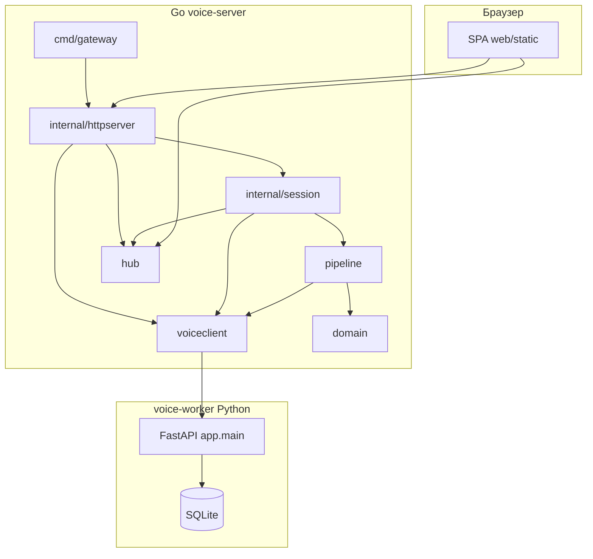

# Архитектура voice-server

Каталог `services/voice-server` оформлен как **отдельный Go-модуль** (`module voice-server`) и не импортирует код из родительского `mafia-analyzer`. Принципы: разделение ответственности, зависимости направлены **внутрь** (от delivery к domain), инфраструктура (HTTP-клиент к Python, ffmpeg) изолирована.

## Диаграмма компонентов

## Слои (clean architecture, упрощённо)

| Слой | Пакет | Роль |
|------|-------|------|
| **Сущности** | `internal/domain` | `Segment` — структуры данных, общие для пайплайна и JSON |
| **Персистентность партий** | `internal/gamedb` | Локальный SQLite: партии с `capture_source` / `session_mode`, реплики для офлайн-анализа (отдельно от реестра голосов в Python) |
| **Сценарии** | `internal/session` | Один глобальный сеанс: ingest / file / record, отмена контекста, публикация событий и запись в `gamedb` |
| **Инфраструктура (аудио + сеть)** | `internal/pipeline` | ffmpeg, нарезка чанков, multipart на `process_chunk` |
| **Инфраструктура (клиент worker)** | `internal/voiceclient` | HTTP к FastAPI: reset, process_chunk, voices, label |
| **Доставка (real-time)** | `internal/hub` | WebSocket: рассылка сегментов и статусов |
| **Доставка (HTTP)** | `internal/httpserver` | chi: REST API, CORS, раздача `web/static` |
| **Composition root** | `cmd/gateway` | Флаги, сборка зависимостей, `ListenAndServe` |

Правило: `domain` не зависит ни от чего; `session` зависит от `hub`, `voiceclient`, `pipeline`; `httpserver` зависит от `session`, `hub`, `voiceclient`, но не наоборот.

## Python: voice-worker

Каталог **`voice-worker/`** — отдельный сервис:

- `app/` — FastAPI, пайплайн WhisperX/pyannote, реестр голосов
- `data/` — SQLite по умолчанию (`voice_registry.sqlite`), путь переопределяется `VOICE_SERVER_DB`
- `requirements.txt`, `run.sh` — запуск uvicorn

Gateway **не встраивает** Python: только HTTP-клиент по `-voice-url` (например ngrok с Colab).

## Статика

Файлы UI лежат в **`web/static/`**. Gateway отдаёт их с fallback на `index.html` для SPA. Путь можно переопределить флагом `-static`.
